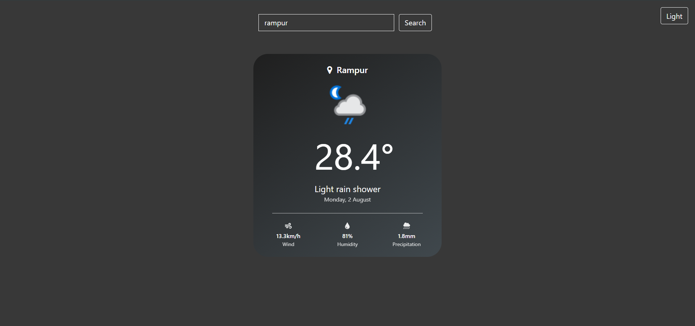

# Weather Web App [Dark Mode Enabled]

A web app that provides you current weather conditions of locations around the globe. It uses weather API to fetch the data, also implemented error-handling in case the user enters a wrong location.

### <a href="https://thedeepakchaturvedi.github.io/WeatherAPI-Redux/">https://thedeepakchaturvedi.github.io/WeatherAPI-Redux/</a>

## Tech Stack

<ul>
<li>Redux</li>
<li>ReactJS</li>
<li>Bootstrap</li>
<li><a href="https://www.weatherapi.com/">Weather API</a></li>
<li>HTML & CSS</li>
</ul>

## DEMO

 

 

 

